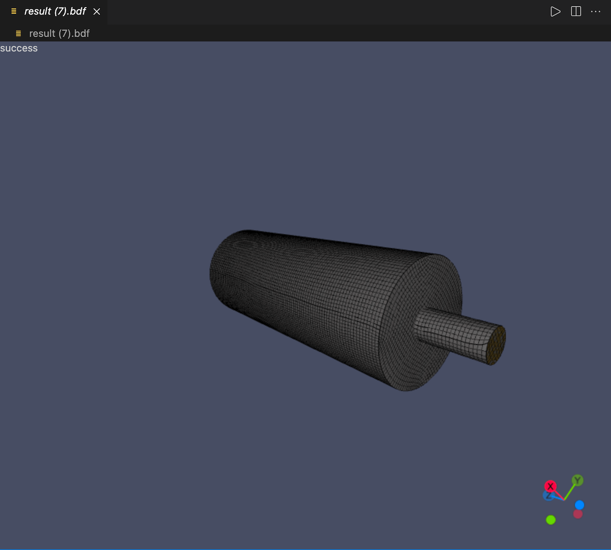

# [meshViewer](https://github.com/zjc0707/vscode-meshViewer)

Preview vtk/obj/bdf in VSCode

## How to use

1. right click the file from the context menu
2. choose `open with...` 
3. choose `meshViewer`

## Features

1. Support formats:
   - obj
   - vtk 2.0/3.0
   - bdf
2. Basic camera operations:  move/rotate/pan

## Requirements

Visual Studio Code v1.56.0

## Credits

* [Visual Studio Code](https://code.visualstudio.com/)

* [THREE.js](https://threejs.org)

